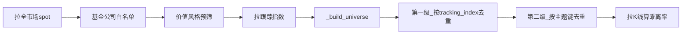

# ETF Watch v0.2 改造计划（备查）

> 归档日期：2026-06-04  
> 状态：**部分实现**（v0.1 冻结 + v0.2 脚本/主题去重/白名单已落地；全量 `--force-full` 验证待跑）  
> 来源：Cursor 计划 `etf基金公司白名单_7ba60d51.plan.md`

---

## 概述

在 `akshare-etf-watch` 内按 `scripts/v01`（全市场 v0.1 冻结）与 `scripts/v02`（基金公司白名单 v0.2 + `--fund-managers`）分版本；缓存分目录；二级主题去重默认 `enhanced` + `config/themes.json`。

## 实施待办

| ID | 内容 | 状态 |
|----|------|------|
| freeze-v01 | 将当前 `scripts/etf_watch.py`、`verify_etf_watch.py` 复制到 `scripts/v01/`；v01 继续使用 `cache/` | done |
| scaffold-v02 | 复制到 `scripts/v02/`，缓存改为 `cache/v02/`，输出 `skill_version=0.2` | done |
| add-manager-filter | v02 增加管理人白名单逻辑 | done |
| add-theme-dedupe | v02 增加 `_dedupe_by_theme`、CLI `--theme-dedupe`（默认 enhanced） | done |
| add-themes-json | 新增 `config/themes.json` 及加载逻辑 | done |
| add-cli-fund-managers | v02 新增 `--fund-managers` CLI | done |
| update-output-meta | 扩展 excluded / meta / result 字段 | done |
| root-wrapper | 根目录脚本薄入口转发 v02 | done |
| update-skill-doc | 更新 `SKILL.md` 版本说明 | done |
| add-unit-test | v02 verify 增加白名单/主题去重测试 | done |
| run-force-full | v02 `--force-full` 验证 | pending |

---

## 版本策略（同技能多脚本）

**一个技能目录、两套脚本、两套缓存**，v0.1 冻结不动，v0.2 承载新功能。

```
akshare-etf-watch/
├── SKILL.md
├── PLAN-v0.2.md             # 本文件
├── config/
│   └── themes.json          # v0.2 主题词清单（同义词 → theme_id，可人工维护）
├── cache/
│   ├── YYYY-Www/            # v0.1 沿用（现有全市场数据）
│   └── v02/
│       └── YYYY-Www/        # v0.2 独立缓存
└── scripts/
    ├── etf_watch.py         # 薄入口：转发到 v02
    ├── verify_etf_watch.py
    ├── v01/                 # v0.1 冻结
    │   ├── etf_watch.py
    │   └── verify_etf_watch.py
    └── v02/                 # v0.2 开发
        ├── etf_watch.py
        └── verify_etf_watch.py
```

| 版本 | 脚本路径 | 筛选范围 | 缓存目录 | 输出标识 |
|------|---------|---------|---------|---------|
| **v0.1** | `scripts/v01/etf_watch.py` | 全市场 ETF | `cache/YYYY-Www/` | `skill_version: "0.1"` |
| **v0.2** | `scripts/v02/etf_watch.py` | 基金公司白名单（默认四家） | `cache/v02/YYYY-Www/` | `skill_version: "0.2"` |

**Agent 默认行为**：`SKILL.md` 执行流程指向 **v0.2**；用户明确要求「全市场 / v0.1 / 旧版」时走 v01。

**实现步骤（先于功能开发）**：

1. `cp scripts/etf_watch.py → scripts/v01/`（及 verify），v01 除 `skill_version` 外不改逻辑
2. `cp scripts/v01/* → scripts/v02/`，v02 修改 `_cache_dir` 为 `skill_root / "cache" / "v02" / week_key`
3. 仅在 **v02** 上实现基金公司白名单 + `--fund-managers` + 主题去重
4. 根目录 `scripts/etf_watch.py` 改为调用 v02

---

## 目标（v0.2）

将「全市场 ETF」改为 **基金公司白名单** 产品池（**默认四家**，可通过 CLI 调整）：

| 基金公司（默认） | 名称匹配关键字 |
|---------|---------------|
| 华夏基金 | `华夏` |
| 易方达 | `易方达` |
| 国泰基金 | `国泰` |
| 景顺长城 | `景顺长城` 或 `景顺`（内置别名） |

其余规则不变：排除无跟踪标的 / 货币债券银行红利等价值风格；**保留跨境 ETF**；筛选分 **两级去重**：

1. **第一级（跟踪标的）**：同一 `tracking_index` 只保留份额最大的一只（四家之间也去重）
2. **第二级（主题名称）**：指数去重后，**theme_id 相同** 的 ETF 再合并，仍留份额最大的一只

---

## 数量估算（基于现有 cache 模拟）

| 阶段 | 数量（默认四家） |
|------|----------------|
| 管理人白名单后 universe | ~329 |
| 第一级：按 tracking_index 去重 | **~204** |
| 第二级：`--theme-dedupe exact` | **~187** |
| 第二级：`--theme-dedupe enhanced`（**默认**） | **~170～180** |

> 原估「100～150」偏低：那是全市场 selected 中四家产品的计数（~113），与 v0.2「仅在四家池内去重」不是同一口径。

---

## v0.2 流水线



仍从新浪/东财/同花顺 **一次拉全市场列表**，在本地用基金 **简称** 过滤。

---

## 代码改动（仅 `scripts/v02/etf_watch.py`）

> v01 文件保持冻结。

### 1. 管理人白名单

```python
_DEFAULT_FUND_MANAGERS = ("华夏", "易方达", "国泰", "景顺长城")

_FUND_MANAGER_ALIASES = {
    "景顺长城": ("景顺长城", "景顺"),
}
```

新增函数：`_parse_fund_managers`、`_expand_manager_match_tokens`、`_build_manager_matchers`、`_match_fund_manager`、`_is_allowed_fund_manager`。

### 2. CLI `--fund-managers`

```bash
python skills/akshare-etf-watch/scripts/v02/etf_watch.py --data-source sina --force-full
python skills/akshare-etf-watch/scripts/v02/etf_watch.py --fund-managers 华夏,易方达 --force-full
python skills/akshare-etf-watch/scripts/v01/etf_watch.py --data-source sina --force-full  # v0.1
```

变更 `--fund-managers` 或 `--theme-dedupe` 后必须 `--force-full`。

### 3. 第二级去重：规则 + `config/themes.json`

#### 技术选型

| 维度 | 规则 + `themes.json`（**采用**） | 向量相似度 / RAG |
|------|-------------------------------|------------------|
| 可解释性 | 高：输出 `theme_id`、命中 synonym | 低 |
| 误合并风险 | 可控 | 较高 |
| 依赖 | 无 | embedding 模型或 API |
| 维护 | 人工补 synonym | 调阈值、模型漂移 |

**结论**：规则 + `themes.json`；向量检索留作将来 v0.3 实验项，**本次不实现**。

#### CLI `--theme-dedupe`

```python
_VALID_THEME_DEDUPE = ("off", "exact", "enhanced")
_DEFAULT_THEME_DEDUPE = "enhanced"
```

| mode | 规则 |
|------|------|
| `off` | 跳过第二级 |
| `exact` | 标准化名称完全相同才合并 |
| `enhanced`（**默认**） | exact + `themes.json` 映射到 `theme_id` |

#### `config/themes.json` 示例

```json
{
  "version": "1",
  "strip_suffixes": ["成长", "行业", "产业", "指数", "龙头", "主题"],
  "strip_prefixes": ["中证", "国证", "上证", "深证", "恒生", "MSCI"],
  "themes": [
    {
      "id": "chip",
      "label": "芯片",
      "match": ["芯片", "半导体", "集成电路"]
    },
    {
      "id": "software",
      "label": "软件",
      "match": ["软件", "计算机", "信创"]
    },
    {
      "id": "grid_equipment",
      "label": "电网设备",
      "match": ["电网设备", "电力设备"]
    }
  ]
}
```

**映射逻辑** `_resolve_theme_id(name, themes_cfg)`：

1. `normalized = _theme_key_exact(name)`，应用 json 中 strip 规则
2. 命中某 theme 的 `match`（子串包含，**最长 match 优先**）→ 返回 `theme.id`
3. 否则返回 `normalized` 作为 fallback（未收录主题不强行合并）

可选 CLI `--themes-file` 覆盖路径。

**调用顺序**：

```python
universe, excluded = _build_universe(...)
by_index, _ = _dedupe_by_index(universe)
selected, theme_merged = _dedupe_by_theme(by_index, mode=theme_dedupe, themes=themes_cfg)
excluded["theme_merged"] = theme_merged
```

### 4. 输出 JSON / meta

- `summary.excluded`：`fund_manager`、`theme_merged`
- `summary`：`after_index_dedupe_count`、`after_theme_dedupe_count`
- `meta`：`fund_managers`、`theme_dedupe`、`themes_file`、`themes_version`
- `result.json`：`fund_managers`、`theme_dedupe`、`skill_version: "0.2"`
- selected 每条：`theme_id`、`theme_label`、`theme_peer_count`、`fund_manager`

---

## SKILL.md 待更新项

- 新增「版本说明」：v0.1 / v0.2 命令与缓存路径
- 默认执行 v0.2；主题清单维护说明
- `--fund-managers`、`--theme-dedupe` 示例

---

## 测试

**`test_fund_manager_whitelist`**：华夏/易方达/国泰/景顺通过；天弘拒绝；指定管理人子集过滤。

**`test_theme_dedupe`**：

| 输入 | mode | 期望 |
|------|------|------|
| 电网设备华夏 + 电网设备国泰 | enhanced | 1 只 |
| 半导体 + 芯片 | enhanced | 1 只 |
| 创业板 + 创业板成长 | enhanced | 1 只 |
| 创业板 + 创业板成长 | exact | 2 只 |
| 任意 | off | 不合并 |

---

## 验证步骤（实现后）

```bash
python skills/akshare-etf-watch/scripts/v02/verify_etf_watch.py
python skills/akshare-etf-watch/scripts/v01/verify_etf_watch.py
python skills/akshare-etf-watch/scripts/v02/etf_watch.py --data-source sina --force-full
```

检查：`after_theme_dedupe_count` 约 170～180；`theme_dedupe=enhanced`。

---

## 预期效果

| 指标 | v0.1 | v0.2 index only | v0.2 enhanced（默认） |
|------|------|-----------------|----------------------|
| universe | ~1364 | ~329 | ~329 |
| selected | ~420 | ~204 | **~170～180** |
| hist 耗时 | ~5～8 min | ~2～3 min | **~1.5～2 min** |

---

## 不在本次范围

- 不修改 v01 脚本逻辑（仅复制 + `skill_version`）
- 不迁移现有 `cache/2026-W23/` 到 v02
- 不实现 embedding / 向量相似度 / 编辑距离聚类（v0.3 可实验）
- 不单独复制整个技能目录
