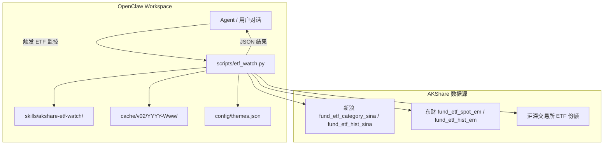
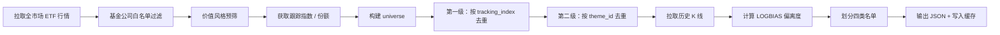

# akshare-etf-watch

基于 [AKShare](https://akshare.akfamily.xyz/) 的 ETF基金乖离率偏离度监控技能：自动筛选代表性 ETF，计算**刘晨明乖离率减法**指标，并输出四类互斥预警名单，供 OpenClaw 助理调用运行。

---

## 功能概述

| 步骤 | 说明 |
|------|------|
| 1. 获取 ETF 列表 | 从新浪 / 东财 / 同花顺拉取全市场 ETF 行情 |
| 2. 产品池筛选 | v0.2 默认仅保留华夏、易方达、国泰、景顺长城四家基金公司产品(脚本可设置包含所有基金公司)；排除货币、债券、银行、红利等价值风格；**保留跨境 ETF** |
| 3. 两级去重 | 第一级：同一跟踪指数只保留份额最大的一只；第二级：按主题合并（默认 `enhanced`，规则 + `config/themes.json`） |
| 4. 计算指标 | 刘晨明乖离率减法（第二版）：`LOGBIAS = (LN(CLOSE) - EMA(LN(CLOSE), 20)) * 100` |
| 5. 分类输出 | 按最近若干交易日偏离度，划分 “关注 / 预警 / 减仓预警 / 离场预警” 四类互斥名单 |

### 四类名单规则（优先级：离场 > 减仓 > 预警 > 关注）

| 名单 | 条件 |
|------|------|
| **关注** (`watch`) | 最近 5 个交易日偏离度均在 `[-5%, 5%]` |
| **预警** (`warning`) | 最近 5 个交易日偏离度均在 `(10%, 15%]` |
| **减仓预警** (`reduce_warning`) | 最近 3 个交易日偏离度均 `> 15%` |
| **离场预警** (`exit_warning`) | 最近 2 个交易日偏离度均 `< -5%` |

### 静态 / 动态数据分离

| 数据类型 | 内容 | 刷新频率 |
|----------|------|----------|
| **静态** | ETF 代码、名称、跟踪指数、去重后的入选名单 | 每周一，或 `--force-full` |
| **动态** | 日线收盘价、偏离度、四类名单 | 每次运行 |

---

## 方案架构

### 总体架构



### v0.2 数据处理流水线



### 目录结构

```
akshare-etf-watch/
├── readme.md                 # 本说明文档
├── SKILL.md                  # OpenClaw Agent 技能定义（触发词、执行流程）
├── PLAN-v0.2.md              # v0.2 改造计划（备查）
├── config/
│   └── themes.json           # 主题同义词映射（第二级去重）
├── cache/
│   ├── YYYY-Www/             # v0.1 缓存
│   └── v02/
│       └── YYYY-Www/         # v0.2 缓存（selected / hist / result 等）
└── scripts/
    ├── etf_watch.py          # 薄入口，默认转发 v0.2
    ├── verify_etf_watch.py   # 自测入口
    ├── v01/                  # v0.1 全市场（冻结）
    │   ├── etf_watch.py
    │   └── verify_etf_watch.py
    └── v02/                  # v0.2 默认版本
        ├── etf_watch.py
        └── verify_etf_watch.py
```

### 版本对比

| 版本 | 脚本 | 产品池 | 缓存目录 | 标识 |
|------|------|--------|----------|------|
| **v0.2**（默认） | `scripts/etf_watch.py` | 四家基金公司白名单 | `cache/v02/YYYY-Www/` | `skill_version: "0.2"` |
| **v0.1**（冻结） | `scripts/v01/etf_watch.py` | 全市场 ETF | `cache/YYYY-Www/` | `skill_version: "0.1"` |

---

## 使用方法

### 1. 安装 OpenClaw

将整个 `akshare-etf-watch` 目录复制到 OpenClaw 工作区的 **skills** 目录下即可：

```
.openclaw/workspace/skills/
```

OpenClaw Agent 会读取目录内的 `SKILL.md`，在对话中识别「ETF 监控」「乖离率」「关注列表」等触发词后，自动执行 `akshare-etf-watch/etf_watch.py`。

> 说明：技能的可执行脚本位于 `skills/akshare-etf-watch/scripts/`；无需单独放到 `workspace/scripts` 根目录。


### 2. 在 OpenClaw 中触发示例

- 「跑一下 ETF 乖离率监控」
- 「刘晨明乖离率 ETF 关注列表」
- 「ETF 减仓预警和离场预警」
- 「强制刷新 ETF watch」

---

### 3. 输出说明

脚本向标准输出打印 JSON，主要字段：

- `skill_version`：版本号（`0.2` / `0.1`）
- `run_mode`：`daily` 或 `static_full+daily`
- `week_key`：缓存周次，如 `2026-W23`
- `indicator_formula`：指标公式说明
- `summary`：各名单数量及去重统计
- `lists.watch` / `lists.warning` / `lists.reduce_warning` / `lists.exit_warning`：四类名单
- 每条 ETF 记录含：`code`、`name`、`tracking_index`、`fund_manager`、`theme_id`、`log_bias_latest`、`deviation_last5`、`list`、`list_reason`

---
报告输出可显示在OpenClaw chat中，或叫它发送邮件。
---